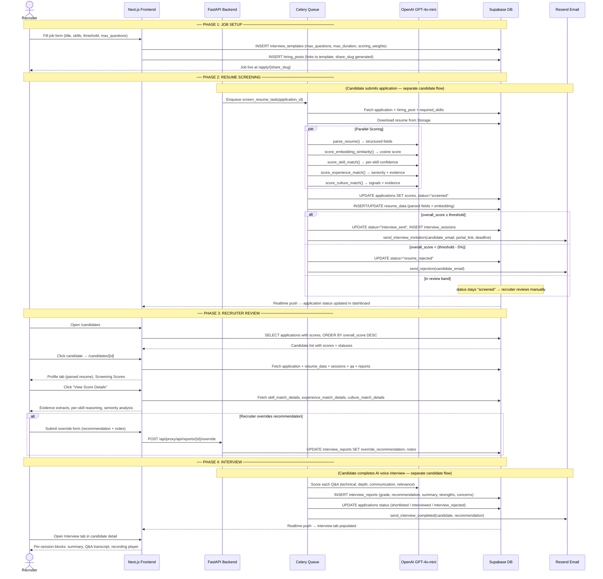
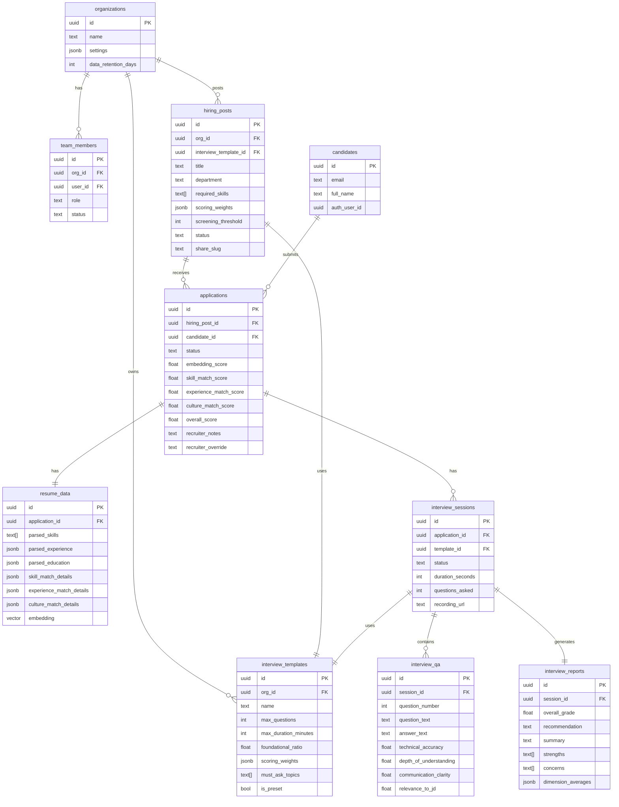

# Recruiter Platform — Architecture Diagram

## Full System Overview

```mermaid
flowchart TB
    subgraph RECRUITER["🧑‍💼 Recruiter Browser (Next.js Client)"]
        direction TB
        R1["Dashboard\n/dashboard"]
        R2["Jobs\n/jobs, /jobs/new, /jobs/[id]"]
        R3["Candidates\n/candidates, /candidates/[id]"]
        R4["Score Details\n/candidates/[id]/score-details"]
        R5["Interview Report\n(interview tab in candidate detail)"]
        R6["Templates\n/templates, /templates/[id]"]
        R7["Analytics\n/analytics"]
        R8["Settings\n/settings — team, scoring, retention"]
    end

    subgraph NEXTJS["⚙️ Next.js Server (Proxy Layer)"]
        P1["POST /api/proxy/[...path]\n(catch-all — forwards to backend)"]
        P2["POST /api/applications/submit"]
        P3["POST /api/email/application-confirmation"]
        P4["POST /api/screening/trigger"]
        P5["GET/POST /api/interview/*"]
    end

    subgraph BACKEND["🐍 FastAPI Backend"]
        direction TB
        A1["POST /api/applications/submit\nUpsert candidate · check dupe\ncreate application (status=applied)\nenqueue screen_resume_task"]
        A2["POST /api/jobs/generate-description\nGPT-4o-mini drafts JD from metadata"]
        A3["POST /api/screening/trigger\nenqueue screen_resume_task"]
        A4["POST /api/email/send\nsend templated email via Resend"]
        A5["POST /api/webhooks/application-created\ntrigger screening on DB insert event"]
        A6["POST /api/webhooks/application-status-changed\nfire email on status transition"]
        A7["POST /api/invitations/send\ninvite team member via email"]
        A8["POST /api/reports/[id]/override\nrecruiter overrides AI recommendation"]
    end

    subgraph QUEUE["🔁 Celery Task Queue (Redis broker)"]
        direction TB
        T1["screen_resume_task\n────────────────\n1. Download resume from Storage\n2. Extract text (PDF/DOCX)\n3. Parallel scoring (ThreadPoolExecutor)\n4. Compute overall_score\n5. Auto-advance / reject / flag\n6. Send candidate email"]
        T2["evaluate_interview_task\n────────────────\n1. Fetch session + QA records\n2. Score each dimension\n3. Generate interview_report\n4. Update application status\n5. Send outcome email"]
    end

    subgraph SCORING["🤖 Scoring Services (GPT-4o-mini)"]
        direction LR
        S1["Embedding Similarity\nresume ↔ JD vectors\ncosine similarity"]
        S2["Skill Match\nper required skill\nconfidence 0–1"]
        S3["Experience Match\nseniority · years\ncomplexity · domain"]
        S4["Culture Match\ncollaboration\ncommunication\ninitiative"]
        S5["Resume Parser\nname · email\nskills · experience\neducation · summary"]
    end

    subgraph EMAIL["📧 Email Service (Resend)"]
        E1["Application Confirmation"]
        E2["Interview Invitation + link + deadline"]
        E3["Rejection (resume)"]
        E4["Post-Interview Outcome\n(advance / borderline / reject)"]
        E5["Status Update (generic)"]
        E6["Team Member Invite"]
    end

    subgraph DB["🗄️ Supabase (PostgreSQL + pgvector)"]
        direction TB
        D1[("organizations\nid · name · settings\nscoring_weights · threshold\ndefault_template_id\ndata_retention_days")]
        D2[("team_members\norg_id · user_id · role\nstatus (invited/active/deactivated)")]
        D3[("hiring_posts\norg_id · title · department\nlocation · description\nrequired_skills[]\nexperience_min/max\nscoring_weights · threshold\ninterview_template_id\nstatus · share_slug\npublished_at · closes_at")]
        D4[("candidates\nemail (unique) · full_name\nphone · current_role\ncurrent_company\nyears_experience · location\nauth_user_id")]
        D5[("applications\nhiring_post_id · candidate_id\nresume_url · status\nembedding_score\nskill_match_score\nexperience_match_score\nculture_match_score\noverall_score\nrecruiter_notes · override")]
        D6[("resume_data\napplication_id (unique)\nparsed_name · parsed_email\nparsed_skills[]\nparsed_experience (jsonb)\nparsed_education (jsonb)\nparsed_summary\nembedding (pgvector 384-dim)\nskill_match_details\nexperience_match_details\nculture_match_details")]
        D7[("interview_templates\norg_id · name\nmax_questions\nmax_duration_minutes\nfoundational_ratio\nscoring_weights (jsonb)\nmust_ask_topics[]")]
        D8[("interview_sessions\napplication_id · template_id\nlivekit_room_name · status\nstarted_at · ended_at\nduration_seconds\nquestions_asked\nrecording_url")]
        D9[("interview_qa\nsession_id · question_number\nquestion_text · answer_text\ntechnical_accuracy\ndepth_of_understanding\ncommunication_clarity\nrelevance_to_jd\nscore_rationale")]
        D10[("interview_reports\nsession_id (unique)\noverall_grade\nrecommendation\nsummary\nstrengths[] · concerns[]\ndimension_averages")]
    end

    subgraph STORAGE["📦 Supabase Storage"]
        ST1["resumes/\napplications/{hiring_post_id}/\n{timestamp}_{filename}"]
        ST2["photos/\ncandidates/{timestamp}_{filename}"]
    end

    subgraph REALTIME["⚡ Supabase Realtime"]
        RT1["applications table\nPostgres changes → browser\ninstant status updates"]
    end

    %% Recruiter → Next.js
    RECRUITER -->|"Supabase client calls\n(direct)"| DB
    RECRUITER -->|"backendFetch → /api/proxy"| NEXTJS

    %% Next.js → Backend
    NEXTJS -->|"server-side HTTP"| BACKEND

    %% Backend → Queue
    A1 -->|"enqueue"| T1
    A3 -->|"enqueue"| T1
    A5 -->|"enqueue"| T1

    %% Queue → Scoring
    T1 -->|"parallel"| SCORING

    %% Queue → Email
    T1 -->|"auto-advance / reject"| E2
    T1 -->|"rejection"| E3
    T2 -->|"outcome"| E4
    A4 --> EMAIL
    A6 -->|"status change"| E5
    A7 --> E6
    P3 --> E1

    %% Scoring → DB
    SCORING -->|"store scores + parsed fields\nstore embedding (pgvector)"| D5
    SCORING -->|"store parsed resume\nstore embedding"| D6

    %% Queue → DB
    T1 -->|"create/update"| D5
    T1 -->|"create"| D8
    T2 -->|"create"| D10
    T2 -->|"update status"| D5

    %% Storage
    T1 -->|"download resume"| ST1
    RECRUITER -->|"upload files"| STORAGE

    %% Realtime
    D5 -->|"row change event"| RT1
    RT1 -->|"push to browser"| RECRUITER
```

---

## Recruiter Workflow: Step-by-Step

---

## Resume Screening Pipeline (Detail)

```mermaid
flowchart LR
    APP["Application Created\nstatus = applied"]

    subgraph DOWNLOAD["1. Ingest"]
        DL["Download resume\nfrom Supabase Storage"]
        EX["Extract text\npdfplumber / python-docx"]
    end

    subgraph PARALLEL["2. Parallel Scoring  (ThreadPoolExecutor)"]
        direction TB
        PA["parse_resume()\n→ name, email, skills,\nexperience, education,\nprojects, certifications"]
        PB["score_embedding_similarity()\n→ embed resume (384-dim)\n→ embed JD (384-dim)\n→ cosine similarity (0-1)"]
        PC["score_skill_match()\n→ evaluate each required skill\n→ confidence score per skill\n→ matched / partial / missing"]
        PD["score_experience_match()\n→ seniority_alignment\n→ years_of_experience\n→ project_complexity\n→ domain_relevance\n+ evidence extract"]
        PE["score_culture_match()\n→ collaboration_signals\n→ communication_style\n→ initiative_indicators\n+ evidence extract"]
    end

    subgraph AGGREGATE["3. Aggregate"]
        AGG["overall_score =\n  embedding   × 20%\n+ skill_match × 35%\n+ experience  × 25%\n+ culture     × 20%"]
    end

    subgraph STORE["4. Store"]
        S1["UPDATE applications\nscores + status"]
        S2["INSERT resume_data\nparsed fields + embedding\n+ detail JSON (evidence)"]
    end

    subgraph DECISION["5. Auto-Advance Logic"]
        D1{"score ≥ threshold?"}
        D2{"score < threshold - 5%?"}
        ADV["status = interview_sent\nINSERT interview_sessions\n→ send invitation email"]
        REJ["status = resume_rejected\n→ send rejection email"]
        HOLD["status = screened\n(awaits recruiter review)"]
    end

    APP --> DOWNLOAD
    DOWNLOAD --> PARALLEL
    PARALLEL --> AGGREGATE
    AGGREGATE --> STORE
    STORE --> D1
    D1 -- yes --> ADV
    D1 -- no --> D2
    D2 -- yes --> REJ
    D2 -- no --> HOLD
```

---

## Data Model (Recruiter-Relevant Tables)

